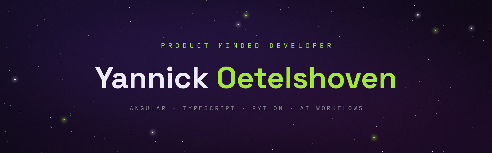

<!-- Profile README · github.com/yannick-oe/yannick-oe -->
<!-- Publish order: commit banner.v1.png to this repo first, then this file. -->

<div align="center">

<a href="https://yannick-oetelshoven.at">
  
</a>

<br>

**Eight years in finance. Product Owner in banking. Self-taught full-stack developer.**<br>
Most developers bring one of the three — I work from the overlap.

Vienna, AT · [**yannick-oetelshoven.at**](https://yannick-oetelshoven.at) · [**LinkedIn**](https://www.linkedin.com/in/yannick-oetelshoven) · [**Email**](mailto:oetelshoven.dev@gmail.com)

`8 yrs business & finance` · `10+ products built` · `Lighthouse 4×100` · `4 Django APIs, 913 tests`

</div>

## The short version

```typescript
type Developer = {
  readonly focus: string;
  readonly stack: Record<"frontend" | "backend" | "ai", readonly string[]>;
  readonly craft: readonly string[];
  readonly principles: readonly string[];
  readonly openTo: string;
};

const yannick = {
  focus: "products, not just features",
  stack: {
    frontend: ["Angular", "TypeScript", "SCSS"],
    backend: ["Python", "Django", "DRF", "PostgreSQL", "Redis", "Docker", "Firebase"],
    ai: ["LLM integration", "workflow automation"],
  },
  craft: ["clean architecture", "accessibility", "performance budgets", "game dev"],
  principles: [
    "start with the user, not the code",
    "AI is leverage, not autopilot",
    "discipline beats talent",
  ],
  openTo: "freelance product work",
} as const satisfies Developer;
```

<details>
<summary><b>The longer story</b></summary>
<br>

I learned business before I learned to build. Eight years in finance — today as a Product Owner in banking — taught me how real companies operate, how regulated industries actually work, and, thanks to a long-running interest in psychology, how the people on both ends of a product think. The engineering I taught myself: frontend, backend, and the AI workflows that connect them — because I wanted to own products end to end instead of handing them off.

</details>

## Things I've shipped

**Products**

| Project | What it is | Built with |
|:--|:--|:--|
| **[Vibo](https://github.com/yannick-oe/vibo)** · [live](https://vibo.yannick-oetelshoven.at) | My biggest build — real-time team chat in the Slack/Discord family: channels, DMs, live sync, architected to extend to mobile and desktop without a rewrite | Angular · TypeScript · Firebase |
| **[Solvara](https://github.com/yannick-oe/Solvara-Echoes-of-the-Wilds)** · [live](https://solvara.yannick-oetelshoven.at) | *Echoes of the Wilds* — a 2D platformer, hand-built: vanilla JavaScript, HTML5 Canvas, custom levels and art. The build I'm proudest of | JavaScript · Canvas |
| **[Portfolio](https://github.com/yannick-oe/Portfolio)** · [live](https://yannick-oetelshoven.at) | My site, engineered like a product — prerendered Angular, bilingual EN/DE, Lighthouse 4×100 on the live domain | Angular · TypeScript · SCSS |
| **[Pokedex](https://github.com/yannick-oe/pokedex)** · [live](https://pokedex.yannick-oetelshoven.at) | Early API work that still holds up — a Pokédex on the PokéAPI, vanilla JavaScript | JavaScript · REST |

**Django services**

| Project | What it is | Built with |
|:--|:--|:--|
| **[Coderr](https://github.com/yannick-oe/Coderr-Backend)** | A freelancer marketplace: 23 endpoints for offers, orders, reviews and profiles, role-based permissions, image uploads. Built to the letter of a written contract — including where the contract contradicts itself | Django · DRF · Token auth |
| **[Videoflix](https://github.com/yannick-oe/Videoflix-Backend)** | Video streaming: uploads convert to HLS in three resolutions on a background worker, JWT lives only in HttpOnly cookies and never in a header. 428 tests at 100% coverage | Django · DRF · Redis · FFmpeg · Docker |
| **[Quizly](https://github.com/yannick-oe/Quizly-Backend)** | A YouTube URL in, a ten-question quiz out — yt-dlp, Whisper and Gemini chained inside a single request, on a time budget I measured before I designed for it | Django · DRF · Whisper · Gemini |
| **[KanMind](https://github.com/yannick-oe/KanMind-Backend)** | A Kanban board API: boards with members, tasks with assignee and reviewer, comments. N+1-free aggregate counts and a 401/403/404 split the frontend can rely on | Django · DRF · Token auth |

Eight picks from 10+ builds. The four Django services were each built against a fixed frontend and a written API doc — the constraint that makes backend work feel like the real thing.

## Now

AI-driven products, built lean. I'm betting that a small, sharp team with AI as leverage beats a big one — and I'm building accordingly. The backend half is no longer the thin one: four Django services shipped this year, the newest of them containerised end to end. Next up: putting one of them on a live domain.

## Work with me

I take on freelance product work: web apps, AI-driven workflows, and full-stack builds that are meant to last. If you're building something and want a developer who treats it like a product, not a ticket — my inbox is open.

**[oetelshoven.dev@gmail.com](mailto:oetelshoven.dev@gmail.com)** · [yannick-oetelshoven.at](https://yannick-oetelshoven.at) · [LinkedIn](https://www.linkedin.com/in/yannick-oetelshoven)

---

<div align="center">

`chore(mindset): a little better today than yesterday`

</div>
